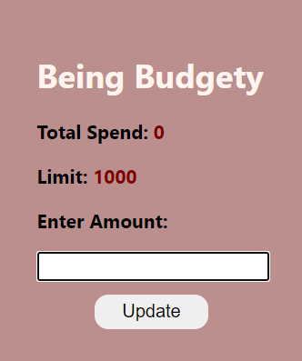
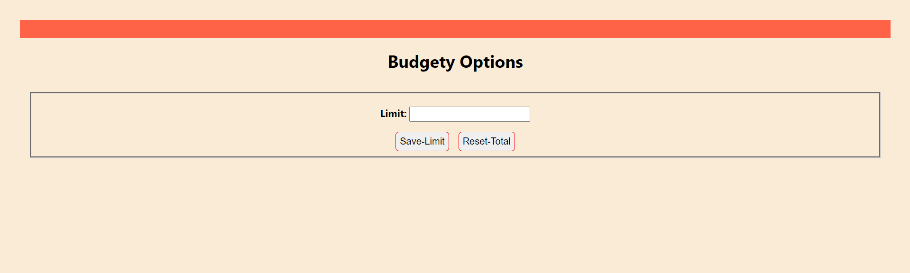

# Budget-Manager-first-chrome-extension
This is a basic Chrome extension which allows you to track your spendings and also gives information about your budget

This is how the extension looks. You can set the limit from the options of the extension, which then will get displayed here. Everytime you make a purchase you can update it here, and it will be updated in the total spendings. Also while making a purchase, select the amount and right click and then hit on "Spend Money" option, and that will also be added to the total spendings. 

Everytime you cross the limit set by you, you will get a chrome notification (Do enable the chrome notifications from the settings of your pc). You can even set the total spendings to 0 from the options of the extension.

